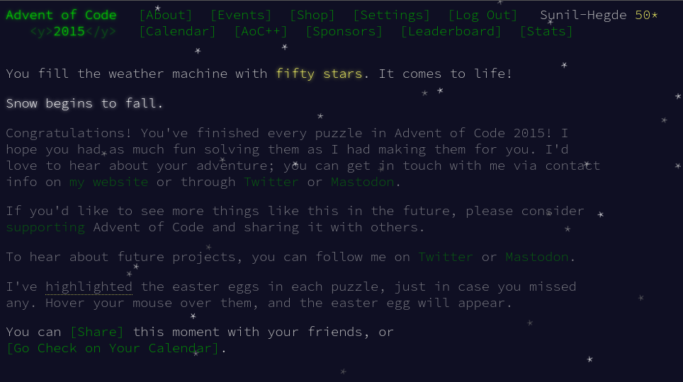

# Day 25: Let It Snow

## Part One

To unlock the weather machine, you need to generate a code based on the position of the code on an infinite grid of numbers filled in diagonally. The code generation algorithm involves multiplying the previous code by 252533 and taking the remainder when divided by 33554393.

Your puzzle answer: `19980801`.

*******

Finally its done!

******************

Visit [here](https://adventofcode.com/2015/day/25) for the problem.